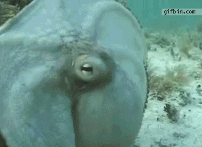

---

published: true
subject:  We're huge fan's of this podcast and why do car brands bang their heads against walls? 
teaser: 📢💥💸 
background: 

---

# Hey you!

This week:

* We convince you to listen to an awesome podcast which will blow your mind.
* Car brands are banging their heads at the wall because young adults simply don't care about cars anymore.
* And Ford is investing huge in electric and hybrid cars.

-

# [This awesome podcast tells us about assisted evolution](http://www.theadaptors.org/)

We are huge fans 🙌🏻 of The Adaptors, a podcast that's about what people do to help the earth adapt to changing climate. Because this week they just made the last episode of their season we tip you Assisting Evolution.

Assited Evolution is a brand spanking new 💥 term of describing the activity of helping nature to evolve in to super survivors. This episodes is about the amazing world of corals. Now usually future of corals are described in a very grim way. These scientists are actually doing realy interesting stuff to help corals adapting to the ever changing environment. Creating Super Corals 💪🏼, why not!

-

# [Gone where the days that owning a car was cool](http://www.fastcoexist.com/3027876/millennials-dont-care-about-owning-cars-and-car-makers-cant-figure-out-why) 
The car 🚗 used to be the symbol of freedom for teens and young adults, data shows those days are gone. From 2007 to 2011, the number of cars purchased by people aged 18 to 34, fell almost 30%. 

Where _baybyboomers_ got their independence from the physical world by meeting friends in real live, nowadays the digital world seems to be more important with smartphones as social vehicles. 

Car brands bouncing their head against walls for solutions. These 18 to 34 age market is huge for them. Well, maybe the power engines 💨 and the sound of cars doesn't cut it anymore. 

Read more on [Fast co.Exist](http://www.fastcoexist.com/3027876/millennials-dont-care-about-owning-cars-and-car-makers-cant-figure-out-why)

-

# [Ford invests big in electric cars](http://www.briefmedia.news/ford-will-invest-4-5-billion-in-electric-cars/)
By big we mean **big**! The oldest comercial car brand in the world is investing $4.5 billion 💸 in electric cars. They announced to develop 13 new hybrid and electric vehicles by 2020 and the company aims to make 40% of the company’s fleet electric or hybrid.

You see? Rough loud diesel engines wil be extinct. The new Ford Focus will reach 80% charged in 30 minutes. The car’s range will also increase from 76 miles to 100 miles. Here you've got your freedom 😜. 

This news on [The Brief](http://www.briefmedia.news/ford-will-invest-4-5-billion-in-electric-cars/)

-

While we're helping nature... Watch this octopus' trick 👏🏻!

If you've got something to show us, please let us know!

