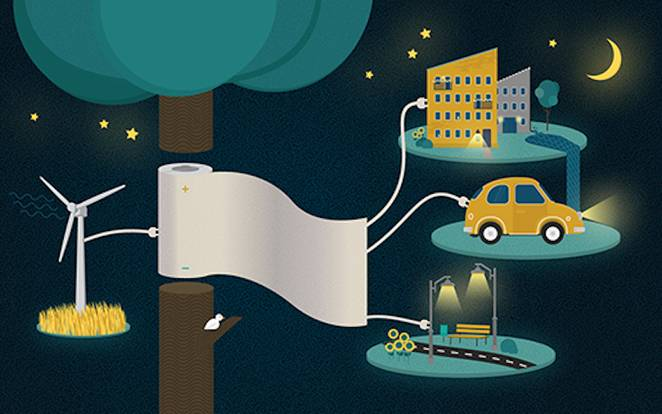
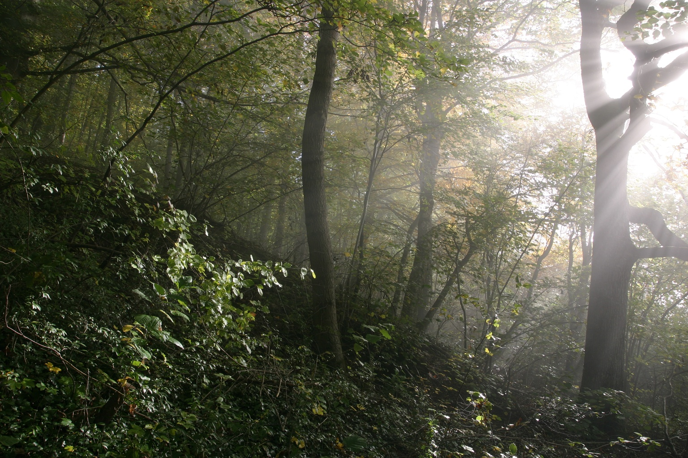
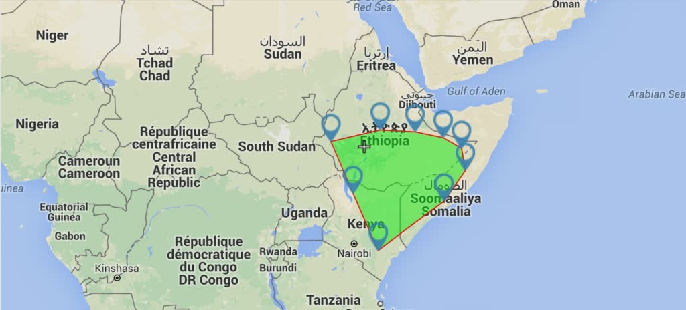
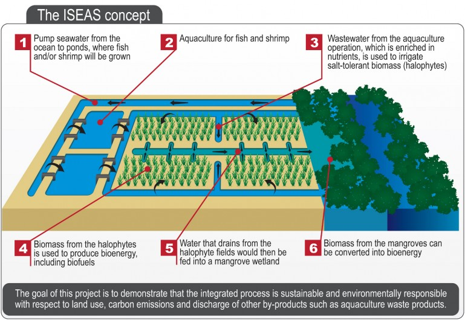

# Hi there!

This week an issue with quite some tech and a lot of trees:

* Batteries made out of paper will be the best thing ever, whut?
* 100 million hectares of reforrestation.
* And a very interesting way of producing biofuels for the aviation industry. 

# [Say what? Batteries made out of paper?](http://www.treehugger.com/clean-technology/best-battery-storing-renewable-energy-could-be-made-paper.html)
Swedish scientists believe they invented a breakthrough in the energy storage technology. This technique could store large amounts of energy in a sustainable way on paper. It's called, Power 💪 Paper!

With some upgrades, normal paper can act like a supercapacitor, some sort of super-battery. The researchers believe that in future these thick layers of Power Paper can function for storing energy from wind, solar and other renewable sources. 

Scientists believe that in future it wil be a safe, less expensive, lightweighted and realy scalable solution. It's waterproof and foldable. What more do you want?

For all the nerds among us, more in-depth technical specifications go to [Treehugger.com](http://www.treehugger.com/clean-technology/best-battery-storing-renewable-energy-could-be-made-paper.html)  

---

# [Africa pledged restoring 100 million hectares of trees 😮!](http://www.onegreenplanet.org/news/african-nations-plant-miles-of-forest/)
A big number of African countries have pledged to restore the continents forests by 2030. It's a big plan to battle the systematic deforestation haunting the continent. Togheter with tackling illigal logging this could be a major step forward improving the lungs of Africa.

Here you see what a combined 100 million hectares of forrest (386,000 square miles) looks like:

 

---

# [What the heck is this image all about?](http://cleantechnica.com/2015/12/11/3-ways-tech-has-the-aviation-industry-poised-for-change-again/)
We are revolutionising flying using solar power, but it will still take a while before commercial airplanes are ready for take-off. Untill we are there we can use biofuels. Biofuels are a much cleaner way to fly and better: we can grow it sustainable 😌.  

The aviation ✈️️ industry is heavily experimenting with biofuels to fly more clean and with renewable sources. One of the most promising is the use of _halophytes_. 

The image above explaines the pruduction of these biofuels. They can grow in salty waters 🌊! So, a lot of space, don't you think? Halophytes can also use aquaculture waste as fertilizer. 

Read more about biofuels and which big aviation companies are investing in this technologies on [Clean Technica](http://cleantechnica.com/2015/12/11/3-ways-tech-has-the-aviation-industry-poised-for-change-again/)

---

For the smart people who found out that this is the 26th issue and that this is exactly 1/2 year: Yes! we're having a birthday!

🎉🎊🎈🎉🎊🎈🎉🎊🎈🎉🎊🎈🎉🎊🎈🎉🎊🎈🎉🎊🎈

Thanks for all your support and lets grow old togheter!

See you next week! 
    
