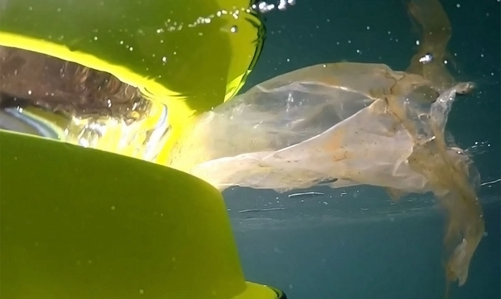

# Hello!

This week an issue all about energy -- and a big rocket!

* Using leftover cheese 🐄to power an entire village?
* Cleaning the water with rubbish bins
* A 'new' way to capture the energy of the sun
* SpaceX's successful landing of the Falcon rocket 🚀

# [1500 houses powered by cheese?](http://www.edie.net/news/5/French-power-station-generates-electricity-for-1-500-from-cheese/)

Any idea how much potential energy is thrown with the garbage by cheese companies? Apparently enough to power an entire village!

This cheese manufacturer decided to partner up with the local power plant to use excess skimmed whey -- an unneeded by-product of making the cheese -- as power for 1500 homes. How cool 😎is that?

The energy comes from the bacteria that find the whey delicious and produce methane, a biogas, in return. Thanks little guys!

[eddie.net](http://www.edie.net/news/5/French-power-station-generates-electricity-for-1-500-from-cheese/)

# [Garbage bins in the water?](http://www.edie.net/news/5/French-power-station-generates-electricity-for-1-500-from-cheese/)

These surfer guys bumped into so much waste while surfing that they decided to create 'garbage bins' to catch the it!

The bins pump in the surrounding water, trapping waste inside the bin. The plastics caught in the bins can be re-used to create more bins. Awesome! You can also put a bin on your solar powered yacht, cleaning the planet while relaxing; doesn't that sound great?

[inhabitat.org](http://inhabitat.com/floating-seabin-sucks-up-ocean-waste-including-oil-and-detergents/)

# [Cool new word: Hydricity](http://www.edie.net/news/5/French-power-station-generates-electricity-for-1-500-from-cheese/)

We have an incredibly strong energy supply that comes by each day: 💥The sun! (Newsworthy right?! 😉)

The problem is not gathering the energy itself, but storing it. 🔬Scientists have proposed the new method 'Hydricity' this week that uses the sun's energy to split water into hydrogen and oxygen. The hydrogen could be directly burned for energy AND it can be combined with carbon from agricultural biomass to produce all kinds neat things, like fuel and other chemicals.

The most awesome thing about it? It doesn't produce any pollution for the planet!

The current challenge, it's still very expensive to store hydrogen and oxygen at high pressures. Anyone up for the challenge?

Read on in a more  [Accessible](http://www.climatecentral.org/news/hydricity-could-boost-renewables-19810) fashion.

Or in a [more thorough](http://phys.org/news/2015-12-hydricity-concept-solar-energy-power.html) way

---

Normally we would want a gif of a 🚀lift-off, going into the future. However, SpaceX has done something amazing this week. It successfully landed a part of the rocket that was used to bring 11 satellites into orbit. This part can now be reused: speeding up the time for another launch, reducing costs and reducing (orbital) waste!

See you next week!
