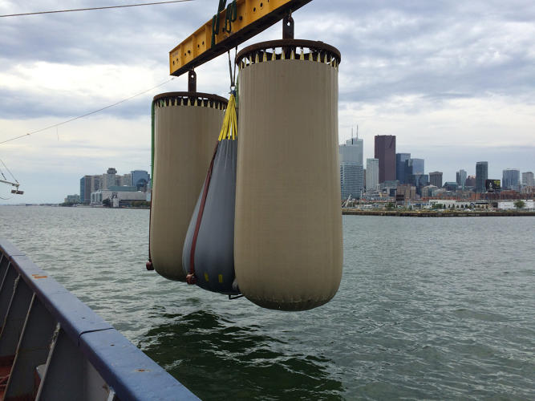

# Happy New Year 🎆

In the first newsletter this year:

* What did we do good in 2015 while saving our planet?
* Why a giant underwater balloon will help storing our midnight energy.
* Biking is getting much more fun if we do it like these two countries.

# [Some great strides made in 2015](http://grist.org/climate-energy/heres-the-good-news-about-earth-from-this-year/)

* It looks like world leaders embraced the alarming science about climate change and are finally ready to do something about it. The Climate Conference in Paris was a big step in forming the foundation to step up our game 💪 and save the planet.

* More and more countries preserve their waters. This year, an ocean [the size of Texas](http://bit.ly/1Tvi7bd) was preserved!

* 2015 was also the beginning of the end of the polluting car. More and more car companies are going electric and new brands emerged. [An increasing number](http://www.bikeleague.org/commutingdata) of people cycle🚲 to work. Young people are no longer interested in owning cars and make different choices when it comes to 'buying their freedom'.

* The renewable energy economy is growing faster than hummingbirds can flap their wings and the prices of clean energy are dropping like Skrillex drops his bass 💥.

Read more on [Grist](http://grist.org/climate-energy/heres-the-good-news-about-earth-from-this-year/)

# Giant balloons🎈in the ocean?

Almost every week we can present a new form of storing sustainable energy! This time: A giant underwater balloon. The balloon is filled with high-pressured air which can be released to generate electricity when sustainable resources won't generate enough, a good night sleep without worries. The balloons are ideally placed 200 meters below sea level because the pressure will be equal on the inside and on the outside. Company Hydrostar promises 80% efficiency. Isn't that resourceful?!

Read more on [fastcoexist.com](http://www.fastcoexist.com/3053854/toronto-is-backing-up-its-electric-grid-with-big-air-bags-at-the-bottom-of-lake-ontario)
