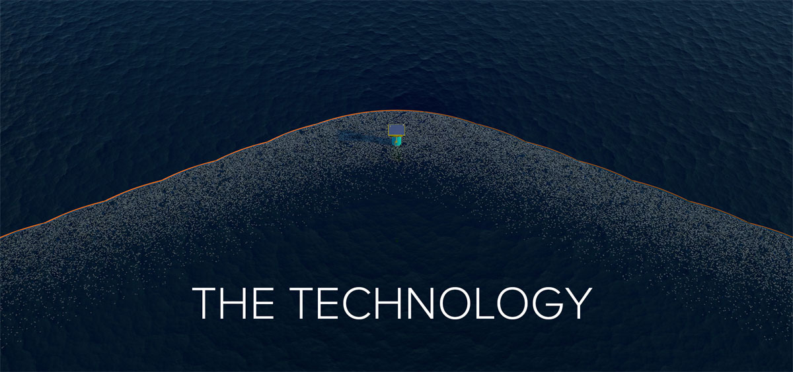
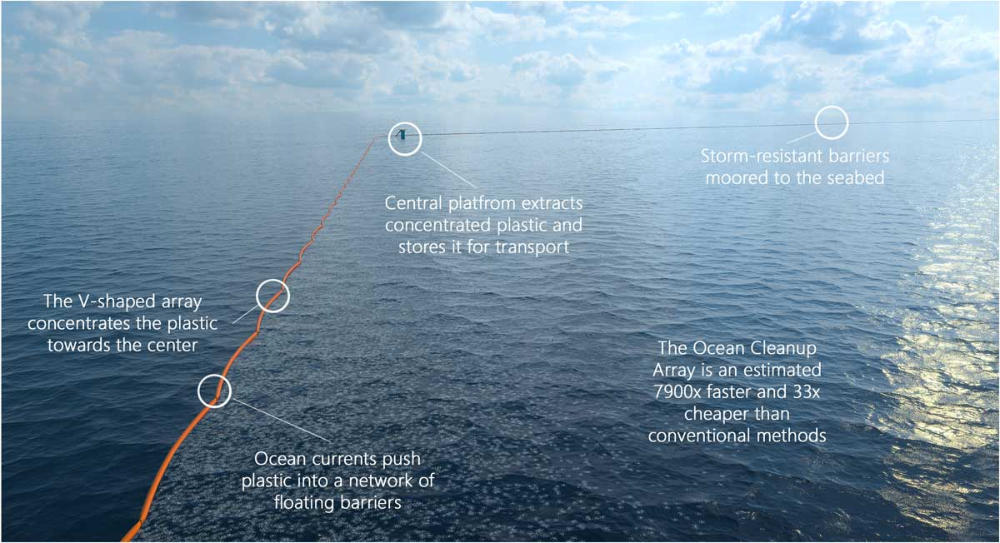
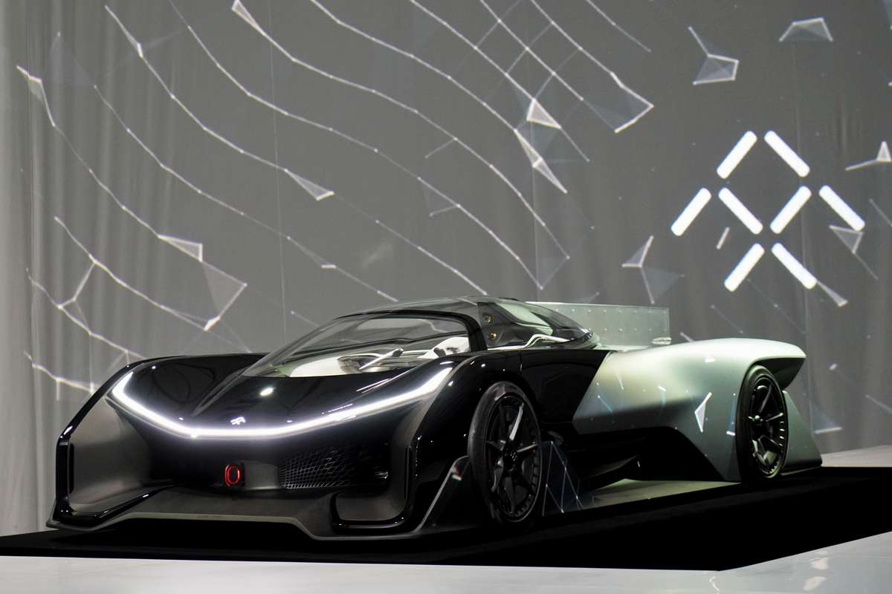
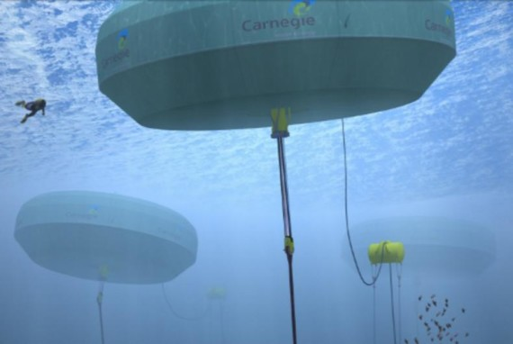
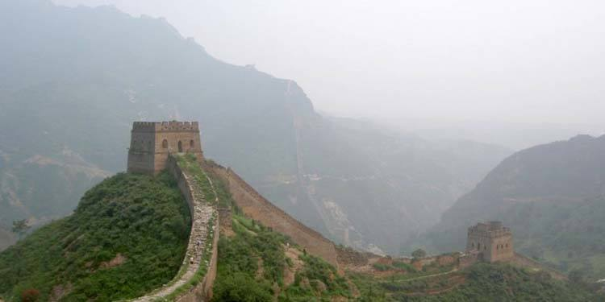

---

published: true
subject:  Look at this electric race monster!
teaser: 🌊🏎🏓
background: 2016-01-08-30-giphy.gif

---

# Hi there!

This very awesome week:

* Cleaning the ocean is getting more serious with this huge installation.
* Faraday Future comes with electronic race monster 🏎.
* China is turning it's back on coal big time.
* Power to surfing 🏄 rafts!

---

# [An ocean cleanup barrier will be deployed in the North Sea  ](http://www.theoceancleanup.com/blog/show/item/first-cleanup-barrier-test-to-be-deployed-in-dutch-waters.html)

A lot of technological initiatives are taken to remove plastic waste from the ocean. These guys mean serious business and are currently testing their 100 meter barrier in the North Sea.

It's part of [The Ocean Cleanup's](http://www.theoceancleanup.com/) vision. They develop technologies to extract, prevent, and intercept plastic pollution with very large barriers. They claim that their solution is 7900 times faster and 33 times cheaper than conventional methods.

Read more on [The Ocean Cleanup](http://www.theoceancleanup.com/blog/show/item/first-cleanup-barrier-test-to-be-deployed-in-dutch-waters.html).

---

# [Electronic 1,000 horsepower race car, eat your hart out Tesla!](http://www.popsci.com/what-is-faraday-future-and-why-should-we-care)

We picture ourselves Driving this beast. Yeah right, crashing into guardrails you mean...💥😁This car's got a staggering 1,000 horsepower.

This spaceship on wheels is from Faraday Future. We allready wrote about this ambitious electric car company. Remember [their head team](http://www.faradayfuture.com/about.html)? It consists almost entirely of former Tesla employees 😅.

Faraday Future is also planning to take on Tesla with 'normal' sedan style cars.

Read more on this [Popular Science](http://www.popsci.com/what-is-faraday-future-and-why-should-we-care) article.

---

# [Wave 🌊 Power 💪!](http://cleantechnica.com/2016/01/04/grid-connected-wave-power-station-turned-australia/)

Watch out for these floating UFO's while surfing 🏄 Australian waters! They already have been feeding electricity to the local power grid. Apart from electricity from the power that waves generate they can also create desalinated water (making fresh water out of salt water).

This current Wave Energy technology uses buoys that activate pumps when moved by waves. With a 7 meter diameter buoy they've now a capacity of 80kw. It's future bigger brother will generate 1000kw and will be 11 meter wide.       

Read more on [Clean Technica](http://cleantechnica.com/2016/01/04/grid-connected-wave-power-station-turned-australia/)

---

# [China turns back on coal](http://ecowatch.com/2016/01/02/china-clamps-down-on-coal/)

* The country will not approve a single coal mine in the next three years.
* They will close 1000 mines in the next year.
* By doing so it will decrease coal production with 70 million tons. That's 63.502.931.800 kilogram (63 billion kg) 🤑😱.

Head aboy China!  

Read more on [Ecowatch](http://ecowatch.com/2016/01/02/china-clamps-down-on-coal/)

---

Turn your Game on 🙌!

If you've got something to show us, please let us know!

Happy weekend!
