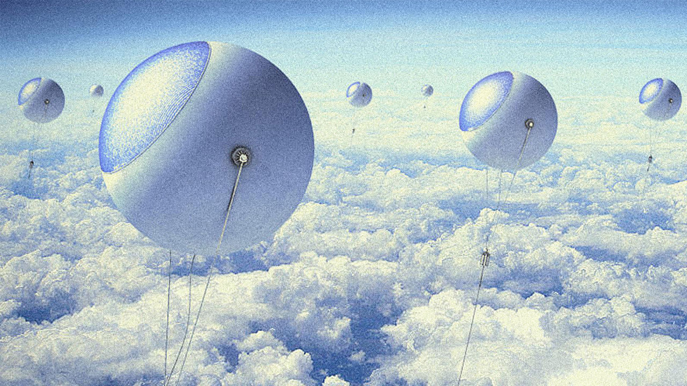
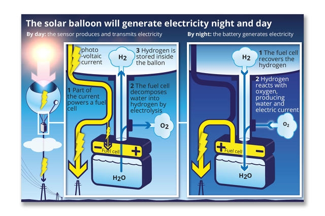
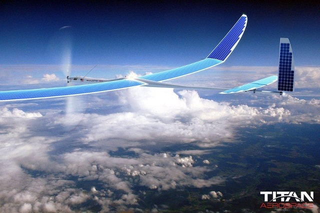
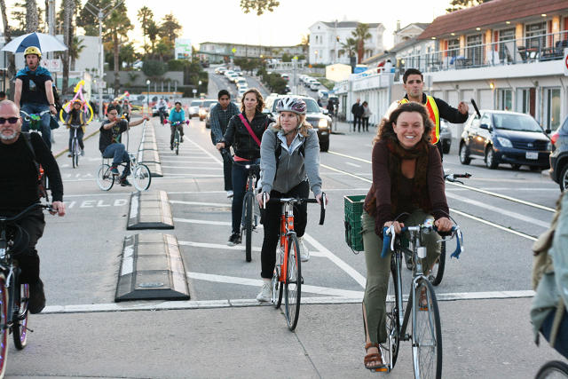

---

published: true
subject: Solar farm balloons 🎈 and drone satellites 📡
teaser: 🎈 📡 🚴
background: 2016-01-15-31-stardust.gif

---

# Hi there!

This very awesome week:

* No excuse to be grumpy about bad weather this week.
* From solar balloons to solar drones, say what?
* More healthy and cleaner revolution starts here.

---

# [Solar farms above clouds?](http://www.fastcoexist.com/3053998/these-sky-high-balloons-could-generate-more-power-than-solar-panels)

Solar farms in the sky, how cool would that be? Nowadays solar energy relies on sunny weather, so although it's a great sustainable technology, it hates clouds ☁☁. So, why not fly above them?

Their potential in generating energy is a staggering three times more than conventional solar panels. The beauty of these high altitude balloons is of course that they can go anywhere! It doesn't take any ground space.       

Let's get technical 📐. This is how it works:

Go to [Fast Co.Exist](url) or go a little bit more in depth on [CNRS News](https://news.cnrs.fr/opinions/solar-energy-aims-for-the-sky-0)

---

# [What's next for the Solar Impulse? Drones? ](http://www.swissinfo.ch/eng/unmanned-flight_solar-impulse-may-turn-into-stratospheric-drone/41872664)

Remember the [Solar Impulse](http://www.solarimpulse.com/) project? An airplane that flew around the world without fueling. This plane relies fully on solar power.

Pilot André Borschberg talks about future plans: Build solar drones to replace satellites 📡. According to Borschberg there's a growing demand to monitor the earth from above.  

"I'm sure that by observing from the sky we can improve the use of the land and the quality of the agriculture, as well as our knowledge of oceans and forests.” he said.

Read more on [Swiss info](http://www.swissinfo.ch/eng/unmanned-flight_solar-impulse-may-turn-into-stratospheric-drone/41872664)

---

# [Let's start a bike 🚲 city revolution](http://www.fastcoexist.com/3054160/better-bike-infrastructure-could-save-cities-25-trillion-and-slash-carbon-emissions)

The hwhbstptw team works from Amsterdam. We go nowhere without our bikes. So, when we stumbled upon this article we couldn't help but grin a little 😌.

A new [report](https://www.itdp.org/a-global-high-shift-cycling-scenario/) from the University of California-Davis and others says: "If the rest of the world biked even a quarter as much as Amsterdam by 2050, cities could save nearly 25 trillion dollars" 💰😱.

Fewer roads to build, and people spending less money to buy vehicles or pay for parking. Cities would also save money by having healthier and fitter 💪 people. Oh, and of course carbon emissions from urban transportation would drop almost 11%!

Some numbers:

* **1%** of New York City trips now happen on a bike. Hold on, with [this](http://www.bicycling.com/culture/advocacy/this-woman-built-400-miles-of-bike-lanes-in-new-york-city) woman, New York will do even better!
* Against **40%** of trips happen by bike in Amsterdam.
* **11%** carbon emission drop.
* more than half of all trips in cities are within biking distance.

It can happen people! Get your bike out and peddle your way in to a healthier and cleaner future. 🌇

Read more on [Fast Co.Exist](http://www.fastcoexist.com/3054160/better-bike-infrastructure-could-save-cities-25-trillion-and-slash-carbon-emissions)

---

Dust your stars 🎵 and go for it this weekend! 💫

If you've found some great articles to show us, please let us know!

Happy weekend!
