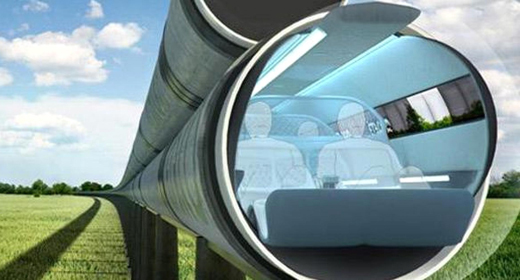
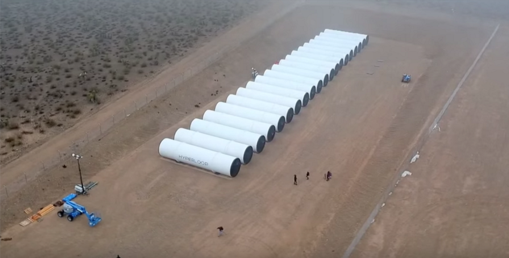
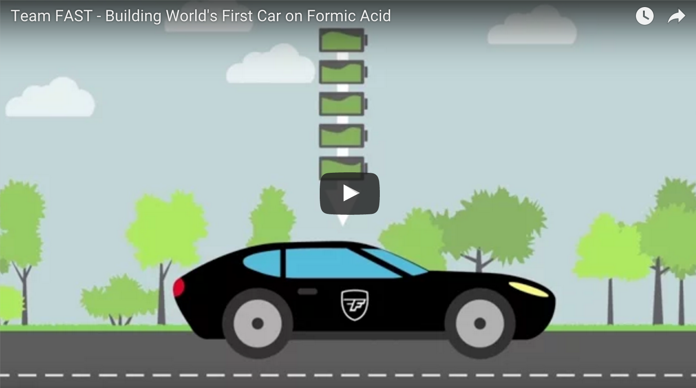
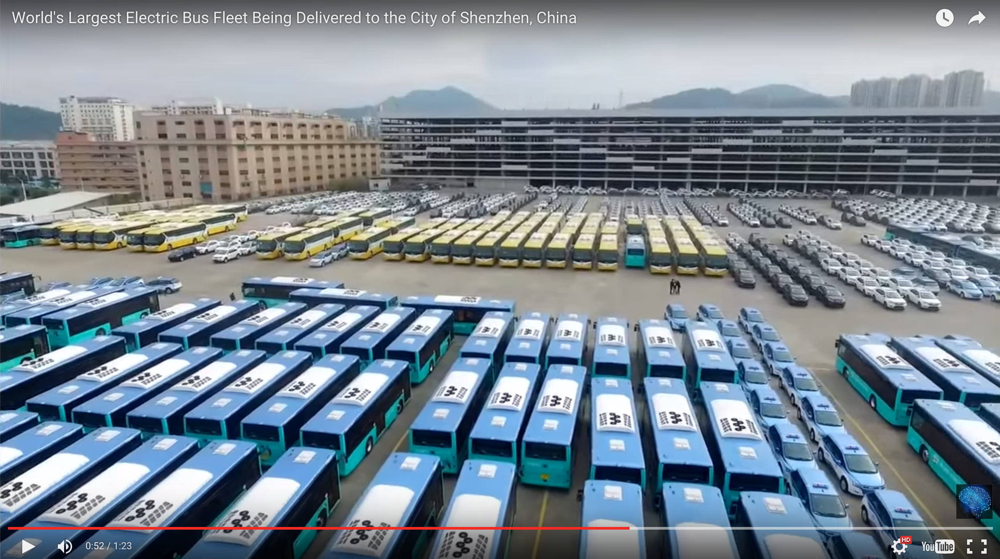

---

published: true
subject: Flying through transit tubes and cars on acid ant farts 🐜💨. Say what?
teaser: 🚝💨🚌
background: 2016-01-22-32-background.gif

---

# Hey you!

This very awesome week:

* We really are going to fly through tubes 🚝💨
* The world's 🌍 first car on formic acid, say what!?
* China placed the biggest order of electric busses 🚎 evar

---

# [The air-driven transit tube is back! ](http://mic.com/articles/132122/the-hyperloop-is-finally-being-built-see-the-photos-here#.4dWs1dj4I)

It's hard to imagine, but the company of [Hyperloop](http://hyperlooptech.com/) is really building this 'pneumatic' (compressed air) tube. These carriages have the potential of going 1126 km/h 💥😱. In comparison, a commercial airplane goes 920 km/h. That's about 200 km/h slower!

Sceptical? Here's some proof they've start building this futuristic tube. Pipes arrived finally in the Nevada dessert:

Not only is the Hyperloop going to be super fast, it's also a carbon free way to travel.

Strange enough this idea of 'pneumatic-air' traveling is not new. In an early New York 1870, there already was a demonstration line, the Beach Pneumatic Transit. The short, one stop tunnel was constructed in only 58 days!

You can read and see all about 'The Beach' on [nycsubway.org](http://www.nycsubway.org/wiki/Beach_Pneumatic_Transit)

Read more on [Tech.Mic](http://mic.com/articles/132122/the-hyperloop-is-finally-being-built-see-the-photos-here#.4dWs1dj4I) and [hyperlooptech.com](http://hyperlooptech.com/) for a peak into the fast future.

---

# [Goal: building the wold's first car on formic acid](http://www.teamfast.nl/)

Team FAST (Formic Acid Sustainable Transport) from Eindhoven University, Holland is building a car on formic acid. Now what's formic acid? I hear you think.

Well: Formic Acid is a sustainable and renewable fuel with zero carbon emissions. It's a natural chemical that ants 🐜 produce as their defense mechanism. There are too many pro's regarding this fuel that we can't mention it all in this newsletter.

Go to [Team Fast](http://www.teamfast.nl/) for more info and see a video explainer.

---

# [Largest electric bus order ever for the city of Shenzhen, China](http://futurism.com/videos/china-releases-worlds-largest-electric-bus-fleet/)

Futurism shows an impressive video of the largest electric bus fleet 🚌🚎🚐 in the world. At this growth rate futurism says, all busses in China will be electric in 2020!

See the video on [Futurism](http://futurism.com/videos/china-releases-worlds-largest-electric-bus-fleet/)

---

Don't mess up your weekend burger!

If you've got something to show us, please let us know!
And why not tell your friends about us? 😁

Happy weekend!
