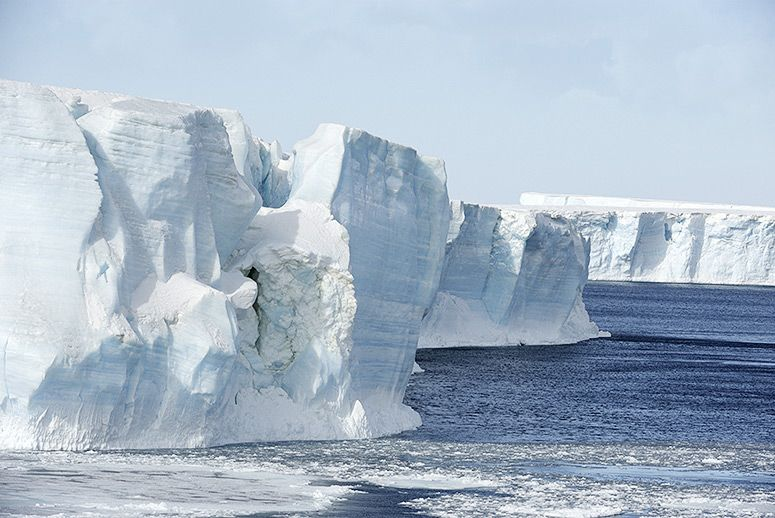

---

published: true
subject: Melting giant icebergs good news?
teaser: 🔋🔥💪😳
background: 2016-01-29-33-workout.gif

---

# Hi there!

This very awesome week:

* Awesome super self-heating battery beats winter
* Melting giant icebergs good news?
* Denmark beats its own world record!

---

# [Awesome self-heating ion battery to the rescue 💪](http://news.psu.edu/story/388410/2016/01/20/research/self-heating-lithium-ion-battery-could-beat-winter-woes)

It's a well known problem that batteries suffer severe power loss when temperatures drop below zero. This self-heating lithium-ion battery solves that problem. With this beast 👹, the range of electric vehicles extend up to 40% longer.  

Read more on [Penn State News](http://news.psu.edu/story/388410/2016/01/20/research/self-heating-lithium-ion-battery-could-beat-winter-woes)

---

# [Melting icebergs are good news? ](http://www.takepart.com/article/2016/01/11/giant-icebergs-antarctica-climate-change-carbon-sink-southern-ocean)

Yes indeed, in short it comes down to this:

We're talking about icebergs ⛄️ which can be 300 kilometers wide and travel through Antartica. On their journey to the ocean they collect phytoplankton (microscopic plants). When these tiny creatures die, they take a lot of carbon with them and sink to the seafloor.

"Researchers 🤓from University of Sheffield and their colleagues concluded that the biological impact of giant iceberg meltwater may account for up to 20 percent of the carbon storage in the Southern Ocean, much more than previously thought."

Read more on [TakePart](http://www.takepart.com/article/2016/01/11/giant-icebergs-antarctica-climate-change-carbon-sink-southern-ocean)

---

*Danish offshore windfarm Nysted (powers 140,000 homes)*

# [Denmark's growth in energy generated from wind is crazy! ](http://energinet.dk/EN/El/Nyheder/Sider/Dansk-vindstroem-slaar-igen-rekord-42-procent.aspx)

In 2015, Denmark generated 42% of it's used electricity with clean energy, a world record! 🎉For Denmark it's not that surprising because they prolonged last year's title; their old record was 39%.

Growth:

   

Who's gonna beat the Danish in 2016?

Read more on [Energinet](http://energinet.dk/EN/El/Nyheder/Sider/Dansk-vindstroem-slaar-igen-rekord-42-procent.aspx)

---

Squat and drink, squat and drink... 😳

If you've got something to show us, please let us know!

Happy, sporty week!
