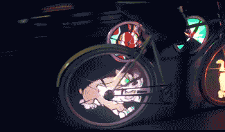

[]

Good news for European 🚵cyclists!

It always feels like such a waste if you have to stop for other traffic while cycling. Denmark and Germany are helping cyclists by severely reducing the amount of times they have to hit the breaks. Denmark is testing with identification tags on wheels to signal upcoming traffic light to turn green. Germany is taking another approach, it's building bicycle superhighways. These highways span more than 60 miles and connect ten cities. Lights allow cyclists to return home after sunset and snow is removed in the winter to ensure the highway can be used year round. Great work!

[Traffic lights -- grist.org](http://grist.org/cities/danish-cyclists-play-god-use-sensors-to-turn-traffic-lights-green/?utm_source=twitter&utm_medium=tweet&utm_campaign=socialflow)
[Highway -- inhabitat.com](http://inhabitat.com/germany-opens-the-first-3-miles-of-a-60-mile-bicycle-superhighway/)
