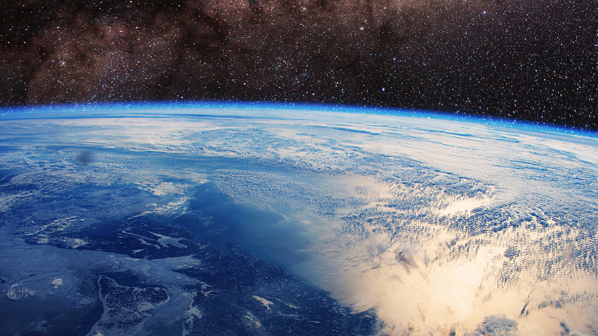

# [Some great strides made in 2015](http://grist.org/climate-energy/heres-the-good-news-about-earth-from-this-year/)

* It looks like world leaders embraced the alarming science about climate change and are finally ready to do something about it. The Climate Conference in Paris was a big step in forming the foundation to step up our game 💪 in saving the planet.

* More and more countries preserve their waters. This year, ocean of [the size of Texas](http://bit.ly/1Tvi7bd) was preserved!

* 2015 was perhaps also the beginning of the end of the car. More and more car companies are going electric, even new brands emerged. [Increasing number](http://www.bikeleague.org/commutingdata) of people riding their bikes 🚲. Young people decrease their car interest and make different choices when it comes to 'buying their freedom'.

* The renewable energy economy is growing faster than hummingbirds can flap their wings and the prices of clean energy are dropping like Skrillex drops his bass 💥.

Read more on [Grist](http://grist.org/climate-energy/heres-the-good-news-about-earth-from-this-year/)
