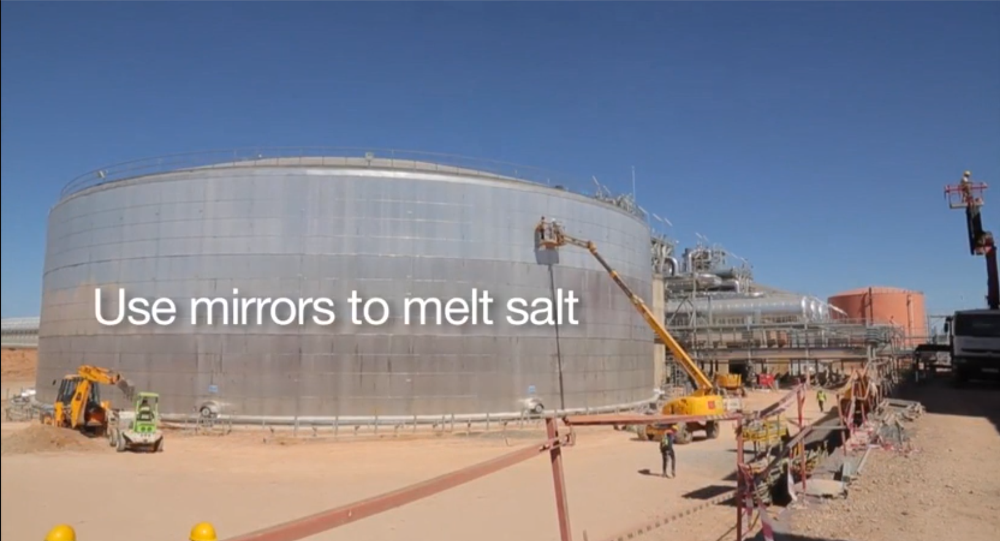
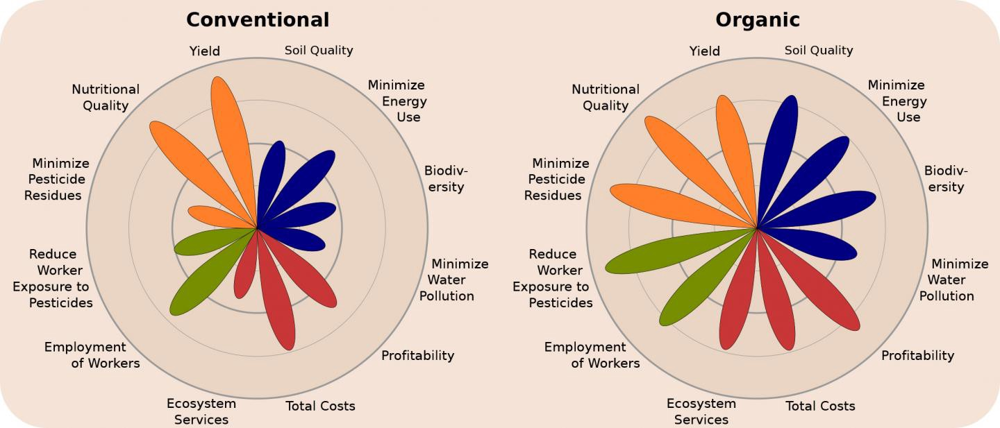
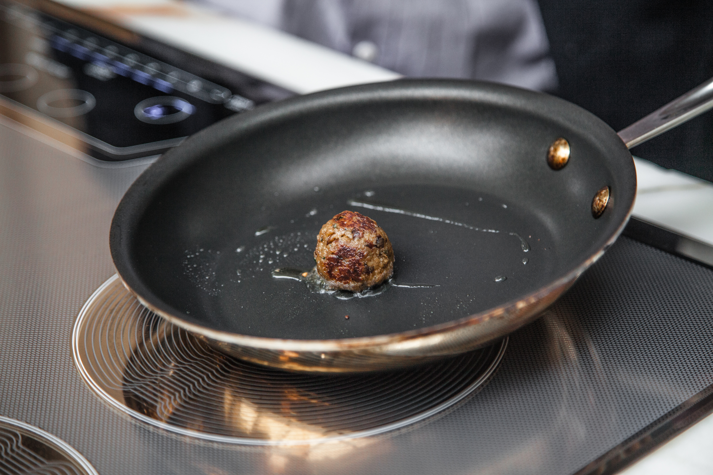
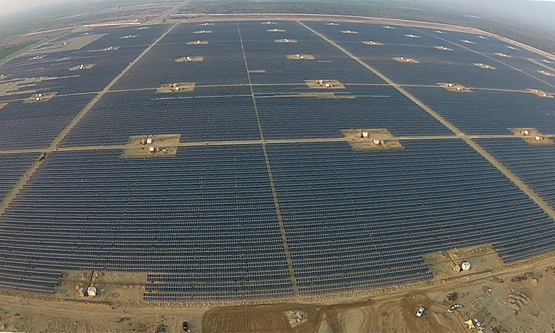

---

published: true
subject: Melting salt powers Morocco and growing meatballs, why not?  
teaser: 🍖🍽🔥🏹
background: 2016-02-09-34-pollman.gif

---

# Hey you 🖖!

This very awesome week:

* Melting salt lights up Morocco in the night
* Feeding 🍴 the global population with sustainable food is really possible
* Growing meat 🍗 without using animals?!
* Economics for solar energy and storage are looking real good, uhu.

---

# [Melting salt powers moroccan city at night ](http://www.bbc.com/news/science-environment-35498592)

Lawrence of Arabia, The Mummy, and the Game of Thrones has been filmed near Ouarzazate, Morocco. So, where there is enough place for epic battles 🏹⚔, on the edge of the Saharan dessert, a massive solar farm emerges.

The city of Ouarazate needs power at night from solar energy, here's where the melting salt comes in. First, the mirrors on the solar panels heat oil running through pipes. Then the oil (that of course can be reused) heats a huge silo full of salt, melts it and uses the energy to light up the city.

Getting hot 🔥 already?      

See a clip on [BBC News](http://www.bbc.com/news/science-environment-35498592)

---

# [Feeding the world with sustainable food](https://medium.com/food-is-the-new-internet/washington-state-university-organic-farming-is-a-double-win-more-profitable-and-more-sustainable-f881ceddded7#.8rlob6juk)

Organic food. We all think we love the taste better than food from conventional farms. In the image above, organic farming is related to conventional farming and it shows that the organic system is better balanced.

"Washington State University researchers have concluded that feeding the global population with sustainability goals in mind is possible. Their review of hundreds of published studies show that organic farming can be profitable for farmers, protect and improve the environment and be safer for farm workers.”

How's that for good news?

Read more on a short post on [Food is the New Internet Channel - Medium](https://medium.com/food-is-the-new-internet/washington-state-university-organic-farming-is-a-double-win-more-profitable-and-more-sustainable-f881ceddded7#.8rlob6juk)

---

# [Using cells from cows 🐄, pigs 🐖 and chickens 🐓 to grow meat  ](https://www.youtube.com/watch?v=Y027yLT2QY0&feature=youtu.be)

"The meatball that will change the world". That's how [Memphis Meats](http://www.memphismeats.com/blog/) sells it. They grow meat without using an animal. Euh... wait, what?! 😮.

This has the potential to innovate the meat industry drastically. Farming animals waste water, it produces massive greenhouse gas emissions and it needs a lot of land because we have to feed them. Spaghetti meatballs, we like it, bon appetit 🍴.        

See more [website](https://www.youtube.com/watch?v=Y027yLT2QY0&feature=youtu.be)

---

# [Storage + solar energy radically expands its value, a lot! ](http://www.vox.com/2016/2/5/10919082/solar-storage-economics)

This very nice informative article on the economics of solar energy and storage on the popular [Vox.com](http://www.vox.com/2016/2/5/10919082/solar-storage-economics) (no, not Fox) states that:

* Projections are made that solar energy is getting as cheap as 2 to 4 cents per kwh.
* Solar + storage is going to be cheaper than utility power for millions of customers within a decade or two.   

Yes, we'll live to see this happening! Although this all sounds quite boring, but the author rewards you with some nerdy humor. Yeah, that's the real reason why we  like it 😉.

Read more on [Vox](http://www.vox.com/2016/2/5/10919082/solar-storage-economics)

---

Gif credits go to the great: Roos Pollman 🖖!

It's a bumpy road but we'll get there.

If you've got something to show us, please let us know!

Happy weekend!
