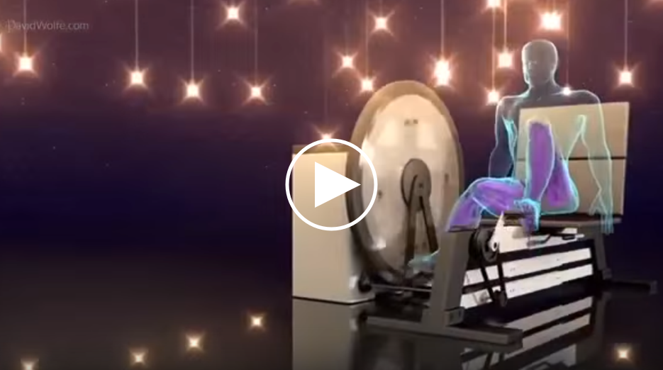

---

published: true
subject:
teaser:
background:

---

# Hey you!

Ready for some optimism? This very awesome week:

* Al Gore is back more positive and stronger 💪 than ever!
* Electric cars 🚗 getting very cheap
* Getting fit 🚴 while charging your house for 24 hours!

---

# [Al Gore is back! Look what happened since the Inconvenient truth](https://www.ted.com/talks/al_gore_the_case_for_optimism_on_climate_change)

Yes, remember [this](https://www.youtube.com/watch?v=wnjx6KETmi4) other very popular documentary from Al Gore when he warned us for apocalyptic times to come? Well, that was released in the year 2006 (see the white arrow in the graph within the image above).

Now the climate change preacher 🎤 shows us that there is proof that we certainly **can** save the planet. Be warned though, as Gore still didn't loose his ability to remember you of all the dangers we're heading. At one point he says: “Every night on the TV news is like a nature hike through the [Book of Revelation](https://en.wikipedia.org/wiki/Book_of_Revelation)” 😂.

We'd advice you to Skip to exactly **12:49** 🕗and see that humans are capable of developing ideas and changing our own future exponentially!   

See the talk on [TED](https://www.ted.com/talks/al_gore_the_case_for_optimism_on_climate_change)

---

# [Title](http://www.theguardian.com/environment/2016/feb/25/electric-cars-will-be-cheaper-than-conventional-vehicles-by-2022)

Text...

Read more on [website](http://www.theguardian.com/environment/2016/feb/25/electric-cars-will-be-cheaper-than-conventional-vehicles-by-2022)

---

# [Title](https://www.youtube.com/watch?v=MZzNuf32o08&feature=youtu.be)

Text...

Read more on [website](https://www.youtube.com/watch?v=MZzNuf32o08&feature=youtu.be)

---

Original ending...

If you've got something to show us, please let us know!

Happy weekend!
